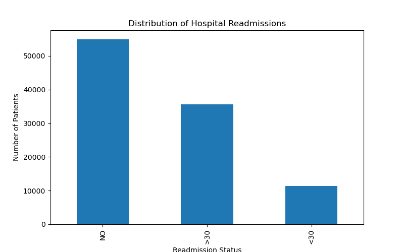
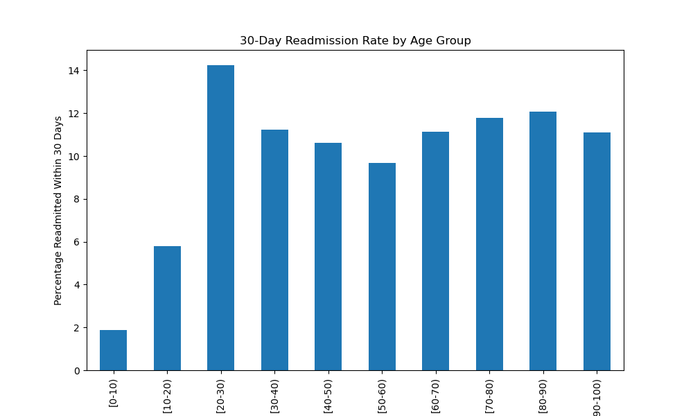
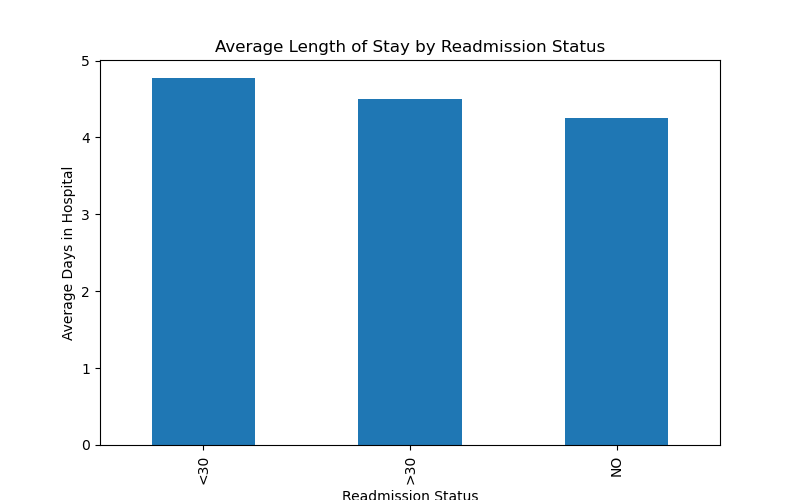
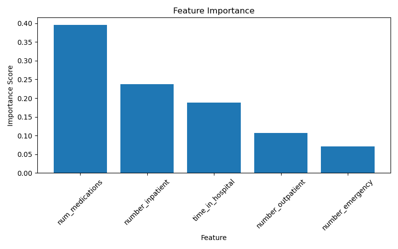

# Hospital Readmission Analysis

## Overview

This project analyzes hospital readmissions among diabetic patients using healthcare data from over 100,000 patient encounters. The objective was to identify factors associated with readmission and explore the use of predictive analytics in healthcare decision-making.

## Dataset

The analysis uses the Diabetes 130-US Hospitals Dataset containing 101,766 patient encounters and 50 variables related to demographics, hospital utilization, diagnoses, medications, and readmission outcomes.

## Tools Used

* Python
* Pandas
* NumPy
* Matplotlib
* Scikit-learn
* JupyterLab

## Project Objectives

* Analyze hospital readmission patterns
* Identify factors associated with readmission
* Explore healthcare utilization trends
* Build a basic predictive model for readmission risk

## Key Findings

### Readmission Distribution

* 53.9% of patients were not readmitted.
* 46.1% experienced at least one readmission episode.

### Length of Stay

Patients readmitted within 30 days had longer average hospital stays than patients who were not readmitted.

### Previous Inpatient Admissions

Previous inpatient admissions showed a strong association with future readmission risk.

### Medication Burden

Patients who were readmitted tended to have a higher number of medications prescribed.

### Emergency Department Utilization

Patients with more emergency visits demonstrated a greater likelihood of readmission.

## Predictive Modeling

A Random Forest classifier was developed to predict readmission status.

Model Accuracy: 59.5%

Most Important Predictors:

1. Number of Medications
2. Previous Inpatient Admissions
3. Length of Hospital Stay
4. Outpatient Visits
5. Emergency Visits

## Conclusion

The analysis identified several factors associated with hospital readmission among diabetic patients. Healthcare utilization history, medication burden, and length of stay emerged as important indicators of readmission risk.

These findings may help healthcare organizations identify high-risk patients and support targeted interventions aimed at reducing avoidable readmissions.

## Visualizations

### Readmission Distribution

### Age vs Readmission

### Length of Stay by Readmission Status

### Feature Importance

